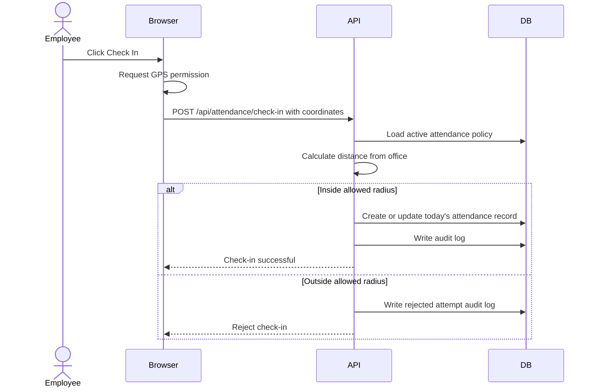
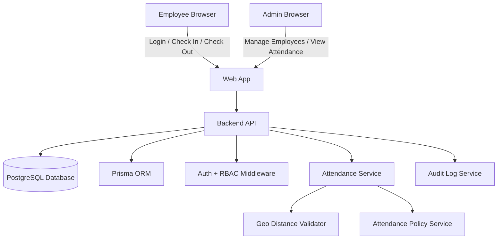

# Employee Attendance System - MVP Project Overview

> File purpose: give Claude, Cursor, Codex, or any coding agent the product context, MVP scope, business rules, and system behavior for a production-ready Employee Attendance System.

---

## 🎯 Product Goal

Build a production-ready web application where employees can check in and check out only when they are physically inside an approved office radius. Admins and managers can manage employees, view attendance dashboards, filter records, and inspect monthly attendance calendars.

This is an MVP, but it must not be built like a demo. Use real authentication, real database persistence, server-side validation, role-based access control, audit logging, and clean architecture.

---

## ✅ MVP Scope

The MVP must include:

1. Authentication for admins, managers, and employees.
2. Role-based dashboards.
3. Employee CRUD management by admin or manager.
4. Employee check-in and check-out.
5. Location validation within a 200-meter office radius.
6. Server-side attendance timestamps.
7. Monthly attendance calendar per employee.
8. Attendance table with filters.
9. Late, absent, present, half-day, and missing-checkout states.
10. Working-hours calculation.
11. Admin correction of attendance records.
12. Production-safe database schema using Prisma.
13. Audit logs for sensitive actions.

Out of MVP:

- Payroll.
- Face recognition.
- QR check-in.
- Mobile app.
- Multi-office support.
- Leave approval workflow.
- Biometric verification.
- Advanced device attestation.

These can be added later, but the database and service architecture should not block them.

---

## 👥 User Roles

### Employee

Employees can:

- Log in with email and password.
- View their own dashboard.
- Check in when they arrive.
- Check out when they leave.
- View today's attendance status.
- View their own monthly attendance calendar.
- View their own attendance history.

Employees cannot:

- Access admin pages.
- View other employees.
- Edit attendance records.
- Mark attendance outside the allowed location radius.
- Modify check-in/check-out timestamps.

### Manager

Managers can:

- Log in to the manager dashboard.
- View employee attendance.
- Filter attendance by employee, department, date, status, lateness, or missing checkout.
- Open employee profile pages.
- View monthly calendar for each employee.

Depending on implementation choice, managers may be limited to employees in their department.

### Admin

Admins can:

- Manage all employees.
- Add, update, deactivate, or delete employees.
- View all attendance records.
- Correct attendance records with a required reason.
- Configure attendance policy, including office location, radius, timezone, and work start time.
- View audit logs.

---

## 🔒 Authentication and Authorization

Recommended auth behavior:

- Use secure password hashing.
- Use HTTP-only cookies or a secure session strategy.
- Protect all employee/admin/manager routes.
- Enforce authorization on the backend, not only in the UI.
- Redirect users based on role after login.
- Store passwords only as hashes, never plain text.

Recommended route groups:

```txt
/auth/login
/employee/dashboard
/employee/attendance
/admin/dashboard
/admin/employees
/admin/employees/:id
/admin/attendance
/admin/settings
```

Authorization rules:

| Route Area | Employee | Manager | Admin |
|---|---:|---:|---:|
| Employee self dashboard | Yes | No | No |
| Own attendance history | Yes | No | No |
| Admin dashboard | No | Yes | Yes |
| Employee management | No | Limited/Optional | Yes |
| Attendance correction | No | Optional | Yes |
| Attendance policy settings | No | No | Yes |

---

## 📍 Location-Based Attendance Rule

Employees can check in or check out only if their device location is within the configured office radius.

Default MVP policy:

```txt
Allowed radius: 200 meters
Location source: Browser Geolocation API
Validation location: Backend server
Timestamp source: Backend server
```

Critical production rule:

> Never trust the frontend to decide whether attendance is valid. The frontend may request location, but the backend must calculate the distance and approve or reject the attendance action.

The frontend sends:

```json
{
  "latitude": 24.0000000,
  "longitude": 46.0000000,
  "accuracyMeters": 35
}
```

The backend:

1. Loads the active attendance policy.
2. Calculates distance from office coordinates.
3. Rejects if distance is greater than the allowed radius.
4. Rejects or flags if reported GPS accuracy is too poor.
5. Uses server time for check-in/check-out.
6. Writes an attendance record and audit log.

User-facing error:

```txt
You are outside the allowed attendance area. Move within the office radius and try again.
```

Important limitation:

> Browser GPS can be spoofed. MVP should mitigate with HTTPS, server validation, accuracy thresholds, audit logs, and anomaly detection. Stronger protection requires a mobile app, device attestation, Wi-Fi verification, Bluetooth beacons, or biometric checks.

---

## 🔁 Employee Attendance Flow



---

## 📊 Admin Dashboard MVP

The admin dashboard should display production data from the database, not dummy arrays.

Dashboard cards:

- Total active employees.
- Present today.
- Late today.
- Absent today.
- Missing check-out today.
- Average working hours for the selected period.

Dashboard sections:

- Recent attendance events.
- Late arrivals list.
- Missing checkout list.
- Employee attendance table.
- Filters for employee, department, date, month, status, and late-only.

Suggested URL:

```txt
/admin/dashboard
```

---

## 📅 Monthly Attendance Calendar

Each employee profile should include a monthly attendance calendar.

Calendar states:

| Status | Meaning |
|---|---|
| PRESENT | Checked in and checked out with enough working hours |
| LATE | Checked in after work start time |
| HALF_DAY | Worked less than full-day threshold but more than half-day threshold |
| ABSENT | No attendance record for a required work day |
| ON_LEAVE | Manually marked leave or future leave feature |
| MISSING_CHECKOUT | Checked in but did not check out |

Monthly employee profile should show:

- Employee details.
- Selected month.
- Calendar grid.
- Attendance records table.
- Present days.
- Late days.
- Absent days.
- Missing checkout days.
- Total worked minutes/hours.

Suggested route:

```txt
/admin/employees/:employeeId?month=YYYY-MM
```

---

## 🗄️ Core Data Objects

### User

Authentication identity for every person who logs in.

Fields:

```txt
id
name
email
passwordHash
role
status
lastLoginAt
createdAt
updatedAt
```

### Employee

Profile record connected to a user.

Fields:

```txt
id
userId
employeeCode
phone
departmentId
jobTitle
hiredAt
status
createdAt
updatedAt
```

### AttendanceRecord

One record per employee per date.

Fields:

```txt
id
employeeId
date
checkInAt
checkOutAt
totalMinutes
status
isLate
lateMinutes
checkInLatitude
checkInLongitude
checkOutLatitude
checkOutLongitude
checkInDistanceMeters
checkOutDistanceMeters
source
correctedById
correctionReason
createdAt
updatedAt
```

### AttendancePolicy

System-wide attendance rules.

Fields:

```txt
id
officeName
officeLatitude
officeLongitude
allowedRadiusMeters
workStartTime
timezone
minimumFullDayMinutes
minimumHalfDayMinutes
active
createdAt
updatedAt
```

### AuditLog

Tracks sensitive actions.

Fields:

```txt
id
actorId
action
targetType
targetId
metadata
ipAddress
userAgent
createdAt
```

---

## System Architecture Diagram



---

## MVP Pages

### Auth

```txt
/login
/logout
```

### Employee

```txt
/employee/dashboard
/employee/attendance
/employee/profile
```

### Admin / Manager

```txt
/admin/dashboard
/admin/employees
/admin/employees/new
/admin/employees/:id
/admin/employees/:id/edit
/admin/attendance
/admin/settings
/admin/audit-logs
```

---

## API MVP

### Auth

```txt
POST /api/auth/login
POST /api/auth/logout
GET  /api/auth/me
```

### Employee Attendance

```txt
GET  /api/employee/attendance?month=YYYY-MM
POST /api/attendance/check-in
POST /api/attendance/check-out
```

### Admin

```txt
GET    /api/admin/dashboard/summary
GET    /api/admin/employees
POST   /api/admin/employees
GET    /api/admin/employees/:id
PATCH  /api/admin/employees/:id
DELETE /api/admin/employees/:id
GET    /api/admin/attendance
PATCH  /api/admin/attendance/:id
GET    /api/admin/settings/attendance-policy
PATCH  /api/admin/settings/attendance-policy
GET    /api/admin/audit-logs
```

---


## UI/Ex Guidlines

## Desing Principles 

## 🎨 UI Design Principles

The UI must be designed specifically for an Employee Attendance System. It should feel like a professional internal HR, operations, and workforce management tool — not a SaaS marketing dashboard, CRM, collections product, analytics template, or design-system showcase.

### 1. Attendance-First Interface

Every dashboard, table, card, and chart must support attendance-related decisions.

Prioritize information such as:

* Who is present today.
* Who is late today.
* Who is absent today.
* Who has not checked out.
* Which employees have incomplete attendance records.
* How many hours employees worked.
* Which records need admin review or correction.

Do not show unrelated SaaS metrics such as revenue, collections, campaigns, leads, conversion rates, subscribers, invoices, marketing assets, or growth analytics.

### 2. Role-Based UI Clarity

The interface must change based on the logged-in user’s role.

Employee UI should focus on:

* Check in.
* Check out.
* Today’s attendance status.
* Location permission status.
* Worked hours.
* Monthly personal attendance history.

Manager UI should focus on:

* Team attendance visibility.
* Department-level filters.
* Late arrivals.
* Missing checkout records.
* Employee attendance profiles.

Admin UI should focus on:

* Full employee management.
* Attendance overview.
* Policy configuration.
* Attendance corrections.
* Audit logs.
* System-wide filters and reporting.

Admin, manager, and employee flows must remain visually and functionally separate.

### 3. Operational Dashboard Design

The admin dashboard should look like a live operations panel for attendance monitoring.

Use practical dashboard cards such as:

* Total active employees.
* Present today.
* Late today.
* Absent today.
* Missing check-out today.
* Average working hours.

Use dashboard sections such as:

* Recent attendance events.
* Late arrivals list.
* Missing check-out list.
* Attendance records table.
* Department and date filters.

Avoid decorative cards that do not help the admin understand attendance status.

### 4. Clear Status System

Attendance status must be easy to scan.

Use consistent badges, labels, and colors for:

* PRESENT
* LATE
* HALF_DAY
* ABSENT
* ON_LEAVE
* MISSING_CHECKOUT

Status labels should appear consistently in:

* Dashboard cards.
* Attendance tables.
* Employee profile pages.
* Monthly calendar.
* Filters.
* Admin correction views.

The user should understand an employee’s attendance state without opening extra details.

### 5. Calendar-Centered Attendance Review

Employee profiles should use a monthly calendar as a primary review tool.

The calendar should make it easy to see:

* Present days.
* Late days.
* Absent days.
* Half days.
* Missing checkout days.
* Leave days.
* Total worked hours for the month.

Each calendar day should show a clear status and allow admins or managers to inspect the related attendance record.

### 6. Fast Filtering and Scanning

Attendance data should be easy to filter, scan, and compare.

Tables should support filters for:

* Employee.
* Department.
* Date.
* Month.
* Status.
* Late-only.
* Missing checkout-only.

Tables should use clear columns, readable spacing, sticky or visible actions, and empty states when no records match the filters.

### 7. Action-Oriented Employee Experience

The employee dashboard should make the next action obvious.

If the employee has not checked in, the main action should be Check In.

If the employee has checked in but not checked out, the main action should be Check Out.

If the employee has completed the day, show check-in time, check-out time, and total worked hours.

The UI should clearly show whether location access is allowed, denied, loading, inaccurate, or outside the approved office radius.

### 8. Location Feedback Must Be Human-Friendly

Location validation errors should be clear and helpful.

Examples:

* “Allow location access to check in.”
* “Your GPS accuracy is too low. Move near a window or try again.”
* “You are outside the allowed attendance area. Move within the office radius and try again.”
* “Attendance policy is not active. Contact an admin.”

Do not expose technical distance calculations as the main user message unless shown as supporting detail.

### 9. Trust, Security, and Auditability

The UI should communicate that attendance data is controlled, validated, and traceable.

Admin correction screens must show:

* Original check-in/check-out values.
* Updated values.
* Required correction reason.
* Who made the correction.
* When the correction was made.

Sensitive actions should feel deliberate, not casual. Use confirmation dialogs for destructive or corrective actions.

### 10. Production-Ready Empty and Error States

Every page must include meaningful empty, loading, and error states.

Examples:

* No attendance records found for this month.
* No late arrivals today.
* No employees match the selected filters.
* Attendance policy has not been configured.
* Location permission denied.
* Unable to load dashboard summary.
* Employee is inactive and cannot check in.

Do not leave blank tables, broken cards, placeholder charts, or dummy content.

### 11. Minimal, Professional Visual Style

Use a clean internal-tool design style.

Recommended style:

* Simple layout.
* Clear typography.
* High contrast.
* Consistent spacing.
* Practical icons only.
* Responsive tables and cards.
* Accessible buttons and form fields.
* Calm status colors.
* No flashy marketing gradients or landing-page sections.

The design should support daily operational use by HR, managers, admins, and employees.

### 12. Data Must Look Real and Connected

The UI should be designed around real backend data.

Do not build screens using static dummy arrays that cannot connect to the database.

Dashboard cards, tables, calendars, filters, and profile pages must be designed as database-backed components that can handle real employees, real attendance records, real timestamps, and real attendance policies.

### 13. Keep the Product Scope Focused

The interface should not introduce unrelated modules unless they support attendance.

Do not add:

* Marketing pages.
* Pricing pages.
* Brand asset libraries.
* Campaign dashboards.
* Collections dashboards.
* Sales CRM sections.
* Finance analytics.
* Generic SaaS widgets.
* Design-system documentation pages.

Everything in the UI must directly support employee attendance, employee management, location-based check-in/check-out, attendance reporting, or admin control.


## Production Rules for Coding Agents

1. Do not use dummy attendance arrays.
2. Persist all employee and attendance data in PostgreSQL.
3. Use Prisma models and migrations.
4. Use server timestamps for attendance.
5. Validate location on the backend.
6. Use role-based authorization middleware.
7. Use input validation for every request.
8. Add database indexes for filters.
9. Add audit logs for admin edits and attendance attempts.
10. Do not allow duplicate attendance records for the same employee and date.
11. Store secrets only in environment variables.
12. Do not commit `.env` files.
13. Add meaningful empty states and error messages.
14. Keep admin and employee UI flows separate.

---

## ⚠️ Edge Cases to Handle

- Employee denies location permission.
- Browser returns low-accuracy GPS.
- Employee tries to check in twice.
- Employee checks in but forgets to check out.
- Employee checks out without checking in.
- Admin corrects a record after payroll review.
- Employee is inactive or suspended.
- Attendance policy is missing or inactive.
- Timezone differences between server and business location.
- User tries to call admin APIs as employee.

---

## 🔗 Useful Reference Links

- Prisma schema documentation: https://www.prisma.io/docs/orm/prisma-schema/overview
- MDN Geolocation API: https://developer.mozilla.org/en-US/docs/Web/API/Geolocation_API
- MDN Using the Geolocation API: https://developer.mozilla.org/en-US/docs/Web/API/Geolocation_API/Using_the_Geolocation_API
- OWASP Authentication Cheat Sheet: https://cheatsheetseries.owasp.org/cheatsheets/Authentication_Cheat_Sheet.html
- OWASP Password Storage Cheat Sheet: https://cheatsheetseries.owasp.org/cheatsheets/Password_Storage_Cheat_Sheet.html
- PostgreSQL documentation: https://www.postgresql.org/docs/current/

---

## MVP Success Criteria

The MVP is complete when:

- An admin can create a real employee account.
- The employee can log in.
- The employee can check in only inside the allowed radius.
- The employee can check out and total hours are calculated.
- The admin can see attendance records in a real dashboard.
- The admin can filter by employee, date, month, status, late-only, and missing checkout.
- The admin can open an employee profile and view a monthly calendar.
- Attendance data survives refreshes and deployments because it is stored in the database.
- Security, validation, and audit logging are implemented.